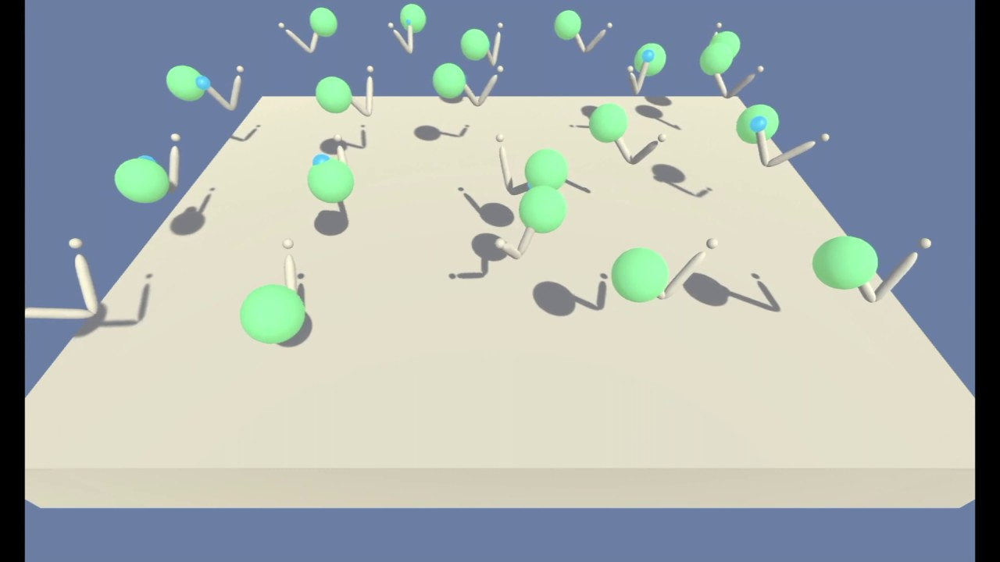

# Project 2 - Udacity Deep Reinforcement Learning Nando Degree

## Reacher

<center></center>

### Problem Formulation

In this environment, a double-jointed arm can move to target locations. A reward of ``+0.1`` is provided for each step that the agent's hand is in the goal location. Thus, the goal of your agent is to maintain its position at the target location for as many time steps as possible.

### State Space

The observation space consists of ``33`` variables corresponding to position, rotation, velocity, and angular velocities of the arm. A sample observation looks like this :

```python
  0.00000000e+00 -4.00000000e+00  0.00000000e+00  1.00000000e+00
 -0.00000000e+00 -0.00000000e+00 -4.37113883e-08  0.00000000e+00
  0.00000000e+00  0.00000000e+00  0.00000000e+00  0.00000000e+00
  0.00000000e+00  0.00000000e+00 -1.00000000e+01  0.00000000e+00
  1.00000000e+00 -0.00000000e+00 -0.00000000e+00 -4.37113883e-08
  0.00000000e+00  0.00000000e+00  0.00000000e+00  0.00000000e+00
  0.00000000e+00  0.00000000e+00  5.75471878e+00 -1.00000000e+00
  5.55726671e+00  0.00000000e+00  1.00000000e+00  0.00000000e+00
 -1.68164849e-01
 ```

### Action Space

Each action is a vector with ``4`` numbers, corresponding to torque applicable to two joints. Every entry in the action vector should be a number between ``-1`` and ``1``.

### Solve Criteria

The Environment is considered solved if the average score for ``100`` consecutive episode reaches ``+30``. In the case that there are multiple agents in the environment, the score for each episode is the average score between each agent presented in the environment.

## Instructions and Structure

### Algorithms Used

The environment is solvable with Deep Deterministic Policy Gradient (DDPG) algorithm. For benchmarking purposes, a PPO agent is also trained on the Multiple-Arm version of the environment. The code for PPO is heavily inspired by the **Dulat Yerzat**'s [RL-Advanture2](https://github.com/higgsfield/RL-Adventure-2) repository.

### Notebooks

1. Use ``DDPG-Train.ipynb`` notebook for Training a DDPG agent.
1. Use ``PPO-Train.ipynb``  notebook for Training a PPO agent.
1. Use ``DDPG-Test.ipynb``  notebook for Testing a trained PPO agent.
1. Use ``PPO-Test.ipynb``   notebook for Testing a trained DDPG agent.
1. For Report check out ``Report.ipynb`` notebook.

### Scripts file

1. ``agents.py`` contains a code for a PPO and DDPG Agent.
1. ``brains.py`` contains the definition of Neural Networks (Brains) used inside an Agent.

### Folders

1. ``TrainedAgents`` folder contains saved weights for trained agents.
1. ``Benchmark`` folder contains saved weights and scores for benchmarking.
1. ``Images`` folder contains images used in the notebooks.
1. ``Movies`` folder contains recorded movies from each Agent.

## Seting up Environment

It is highly recommended to create a separate python environment for running codes in this repository. The instructions are the same as in the Udacity's Deep Reinforcement Learning Nanodegree Repository. Here are the instructions:

1. Create (and activate) a new environment with Python 3.6.

	- __Linux__ or __Mac__: 
	```bash
	conda create --name drlnd python=3.6
	source activate drlnd
	```
	- __Windows__: 
	```bash
	conda create --name drlnd python=3.6 
	activate drlnd
	```
	
2. Follow the instructions in [this repository](https://github.com/openai/gym) to perform a minimal install of OpenAI gym.

- Here are quick commands to install a minimal gym, If you ran into an issue, head to the original repository for latest installation instruction:


	```bash
	pip install box2d-py 
	pip install gym
	```  

	
3. Clone the repository (if you haven't already!), and navigate to the `python/` folder.  Then, install several dependencies.
```bash
git clone https://github.com/taesiri/udacity_drlnd_project2
cd udacity_drlnd_project2/
pip install .
```

4. Create an [IPython kernel](http://ipython.readthedocs.io/en/stable/install/kernel_install.html) for the `drlnd` environment.  
```bash
python -m ipykernel install --user --name drlnd --display-name "drlnd"
```

5. Open the notebook you like to explore.

## Video

See it in action here:

[](http://www.youtube.com/watch?v=udRKojJH35s "REAAAACH!!")
